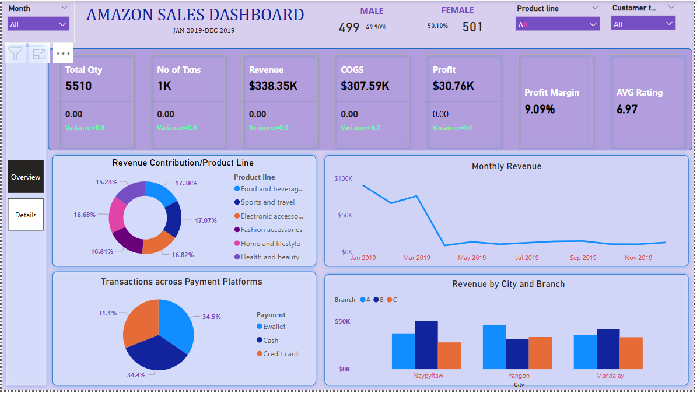
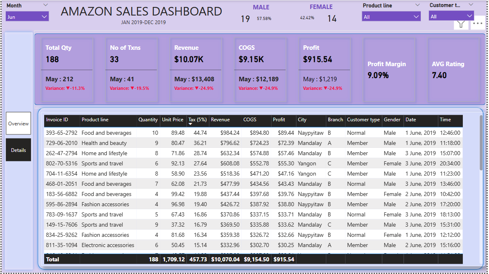

# Amazon Sales Dashboard

## Table of Contents
1. [Project Overview](#project-overview)  
2. [Data Sources](#data-sources)  
3. [Tools](#tools)  
4. [Data Cleaning/Preparation](#data-cleaningpreparation)  
5. [Data Modelling](#data-modelling)  
6. [Dashboard Features](#dashboard-features)  
7. [DAX Measures](#dax-measures)  
8. [Key Questions and Insights](#key-questions-and-insights)  
9. [Key Findings and Insights](#key-findings-and-insights)  
10. [Summary](#summary)  

---

## Project Overview
The **Amazon Sales Dashboard** is a Power BI project created to analyze Amazon sales data. It offers a high-level overview of sales performance, customer preferences, product categories, and other key insights. The dashboard aims to support data-driven decision-making in product management, marketing strategies, and customer engagement.

### Dashboard Preview

#### Amazon Dashboard - Overview

#### Amazon Sales Dashboard - Details

## Data Sources
- **Sales Transactions Dataset**  
  Source: Amazon Sales Data available from Kaggle

## Tools
- **Power BI Desktop**: Download from Microsoft Power BI
- **Excel or CSV Viewer**: For initial data inspection and cleaning.

## Data Cleaning/Preparation
The following data cleaning steps were performed to ensure the dataset is ready for analysis:
- **Remove Duplicates**
- **Handle Missing Values**
- **Standardize Data Types**
- **Validate Data Integrity**

## Data Modelling
- **Define Data Model**: Tables and relationships were defined to provide a structured framework.
- **Create Calendar Date**: A calendar table was created to handle time-based analysis.
- **Create Measures and Calculated Columns**: DAX measures were written to calculate key metrics like revenue, profit, and variance.

## Dashboard Features

### Overview Page
The Overview Page provides a high-level view of essential Key Performance Indicators (KPIs) and visual insights to help users quickly understand the sales performance across various dimensions.
- **KPI Section**: Displays essential KPIs such as Total Revenue, Total Transactions, Cost of Goods Sold (COGS), Profit, Profit Margin, and Average Ratings.
- **Revenue Insights**: Revenue contribution by product line.
- **Sales Trends**: Monthly revenue trend.
- **Customer Preferences**: Transactions across payment platforms.
- **Regional Performance**: Revenue by city and branch.

### Details Page
The Details Page offers a comprehensive view of sales data with tabular information and additional KPIs for deeper analysis.

- **Filters and Slicers**: Filters for Month, Region, Product Line, and Customer Type.
- **Interactive Charts**: Click on chart elements (e.g., product line) to filter data across the dashboard.

---
## Key Questions and Insights
The dashboard answers the following business questions:

- What are the Total Qty, Total Sales, Total Revenue, Cost of Goods Sold, Profit, and Profit Margin for different periods?
- How does the current period’s performance compare to previous periods?
- What are the most and least profitable products?
- What payment platforms were utilized most?
- What are the trends in sales and profit over time?
- Which branches are most profitable in different cities?
- How do customer demographics (gender and customer type) affect buying trends?

---

## Key Findings and Insights

### Revenue Trend
- **Annual Revenue Decline**: Revenue significantly decreased by 86.30% from January to December 2019, indicating a sharp downward trend over the year.
- **Monthly Revenue Drop**: The revenue trend began to decline notably in May 2019, with a total decrease of 24.85% (equivalent to $3,331.79) over the following six months.
- **Steepest Revenue Decline**: The largest decline was observed between January 2019 and March 2019, with revenue dropping from $90,684.62 to $76,213.88.

### Transaction Insights
- **E-wallet Transactions**: The E-wallet payment method accounted for 34.50% of the total number of transactions, showing strong usage of digital wallets among customers.

### Branch Performance
- **Revenue Contribution by Branch and Location**:
  - **Branch B (Naypyitaw)** contributed 14.91% of the total revenue.
- **Highest Average Revenue by Branch**: Branch B had the highest average revenue at $41,376.44.

### Customer Demographics - Gender Analysis
- **Gender Distribution**: The customer base is almost evenly split, with 49.99% male and 50.1% female customers, indicating balanced engagement across genders.

### Customer Type Revenue Analysis
- **Revenue Decline Trends**:
  - **Member Customers**: Revenue for member customers declined by 88.40%.
  - **Normal Customers**: Revenue for normal customers declined by 84.20%.

### Preferred Transaction Methods by Customer Type:
- **Member Customers**: The most common payment method was E-wallet (36.87%).
- **Normal Customers**: Credit card transactions were the top choice (34.33%).

---

## Summary
The **Amazon Sales Dashboard** offers an interactive and user-friendly experience by combining high-level insights on the Overview Page with detailed data exploration options on the Details Page. These features enable users to monitor key sales metrics, identify trends, and make data-driven decisions.
